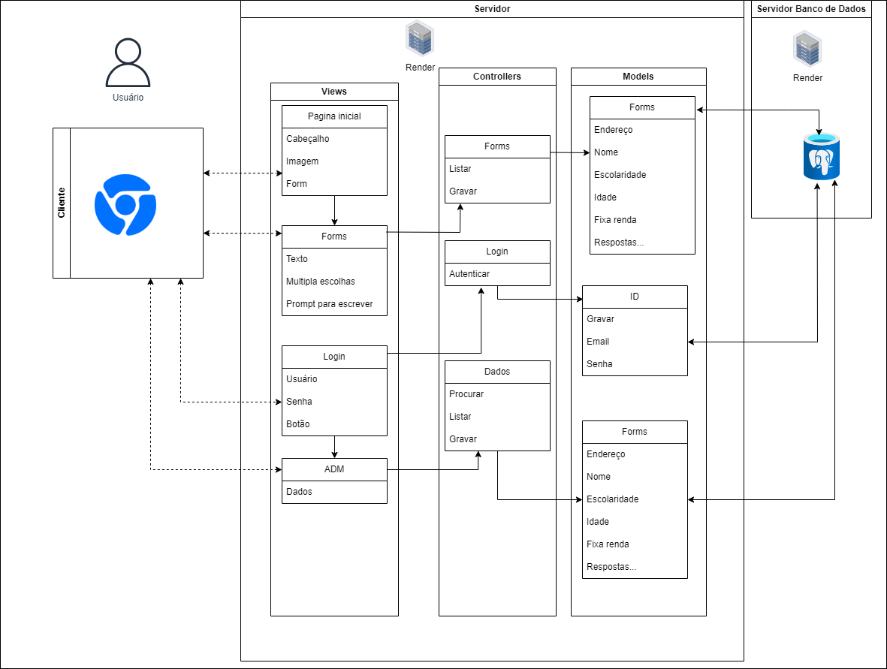

# MVC_ponderada

Na seção dos views, a visão que o usuário terá da página web, primeiramente temos a página inicial onde terá o cabeçalho e imagem que formarão o visual do site e o introduzirá à causa e ao propósito do questionário que ele tomará. Esta página inicial leva para o Forms onde terá as múltiplas escolhas e questões que ele terá que responder. O Forms está conectado ao Controllers, que é o componente que lida com as interações do usuário, manipulando os dados de entrada e atualizando o modelo conforme o usuário interage. No Controllers, o Forms é listado (demonstrar as perguntas conforme o perfil selecionado), e são gravadas as respostas (são salvas para os bancos de dados). Abaixo do Forms, no Views, há a opção do ADM colocar seu Login com senha e um botão para então poder acessar e ver os dados coletados pelo site. Estes dados são procurados dentro dos bancos de dados e então listados para ele, também gravando estes dados.

Os Forms conseguem listar e gravar pois estão ligados ao Models, que representa os dados e a lógica da aplicação, gerenciando os dados, seja alterando conforme solicitações e salvando eles no banco de dados. É a partir do Models que é feito o comando de listar, que lista os dados que o Models pega e gerencia a partir do banco de dados. Os dados do formulário disponíveis para pessoas respondendo e o ADM que quer ver as respostas são gravados e listados deste jeito. Também conectado ao Models está o login do ADM, que gerencia o email e senha do login, e é como a partir dos Controllers autentica que o ADM colocou as informações certas.

O banco de dados escolhido é o PostgreSQL, onde os Models são conectados.

